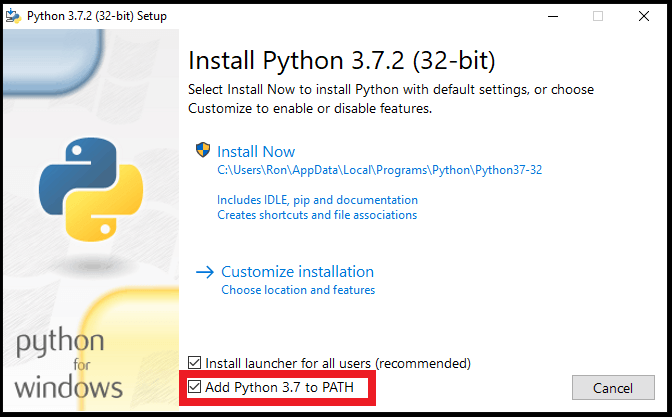
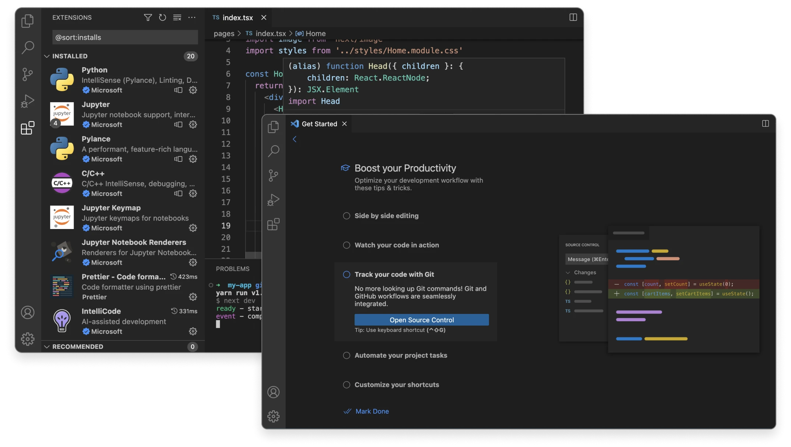
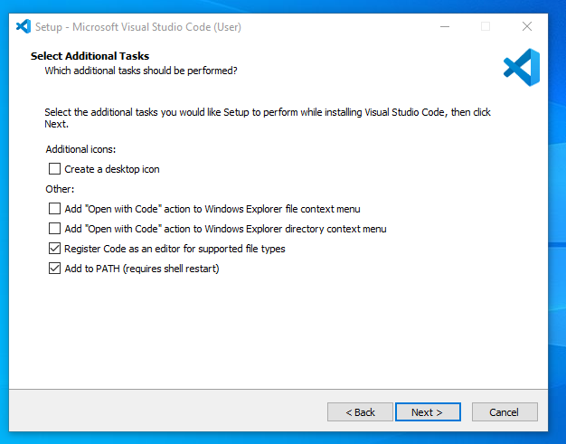
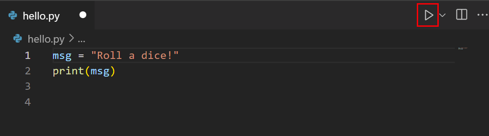

<p align="center">
  
  
</p>

<h1 align="center">Minicurso de Programação Básica em Python</h1>

<p align="center">
  
  
</p>

Olá! Seja muito bem-vindo(a) ao nosso minicurso de **Programação Básica em Python**!

Preparamos este material de apoio para auxiliar você a dar os primeiros passos e deixar seu computador pronto para o minicurso.

Este minicurso é parte do projeto de extensão do curso de Análise e Desenvolvimento de Sistemas (ADS) da FEMA, e foi criado com dedicação por João Pedro Salmazo Pitarelo, Mateus da Silva Alves e Gabriel Ferreira Eccel.

---

### 🧭 Navegação Rápida

* [Dependências para o Minicurso](#-dependências-para-o-minicurso)
* [1. Instalando o Python](#-1-instalando-o-python)
    * [Windows](#12-instalação-no-windows)
    * [macOS](#13-instalação-no-macos)
    * [Linux](#14-instalação-no-linux)
* [2. Instalando o Visual Studio Code](#-2-instalando-o-visual-studio-code-vs-code)
    * [Windows](#22-instalação-no-windows)
    * [macOS](#23-instalação-no-macos)
    * [Linux](#24-instalação-no-linux)
* [3. Configurando o VS Code para Python](#-3-configurando-o-vs-code-para-python)
* [4. Seu Primeiro Programa: "Olá, Mundo!"](#-4-seu-primeiro-programa-em-python-olá-mundo)
* [Autores](#-autores)
* [Referências](#-referências)

---

## Dependências para o Minicurso

O objetivo é guiar você na instalação do **Python** e do editor **Visual Studio Code**, garantindo que tudo funcione perfeitamente.

## 1. Instalando o Python

O primeiro passo é instalar o Python, que é o programa responsável por executar nossos códigos.

#### **1.1. Download do Python**

Acesse a página oficial de downloads do Python: **[https://www.python.org/downloads/](https://www.python.org/downloads/)**.
O site geralmente detecta o seu sistema operacional e oferece o download da versão mais recente e adequada.

#### **1.2. Instalação no Windows**

1.  Execute o arquivo de instalação baixado.
2.  **Importante:** Na primeira tela da instalação, marque a caixa que diz **`Add Python to PATH`**. Isso facilitará a execução de scripts Python a partir do terminal.
    
    <p align="center">
      
    </p>

3.  Clique em **"Install Now"** e siga as instruções até a conclusão da instalação.

#### **1.3. Instalação no macOS**

1.  Execute o pacote de instalação baixado.
2.  Siga as instruções do instalador, clicando em **"Continuar"** e concordando com os termos de licença.
3.  Insira sua senha de administrador quando solicitado para permitir a instalação.

#### **1.4. Instalação no Linux**

A maioria das distribuições Linux já vem com o Python pré-instalado. Para verificar, abra o terminal e digite:

```bash
python3 --version
```

Caso não esteja instalado ou você deseje uma versão mais recente, utilize o gerenciador de pacotes da sua distribuição. Por exemplo, em sistemas baseados em **Debian/Ubuntu**:

```bash
sudo apt update
sudo apt install python3
```

---

## 2. Instalando o Visual Studio Code (VS Code)

O **VS Code** é um editor de código-fonte leve, porém poderoso, que oferece excelente suporte e várias extensões para o desenvolvimento em Python.

<p align="center">
  
</p>

#### **2.1. Download do VS Code**

Acesse a página oficial de downloads do Visual Studio Code: **[https://code.visualstudio.com/download](https://code.visualstudio.com/download)**. O site também identificará seu sistema operacional e fornecerá o link correspondente.

#### **2.2. Instalação no Windows**

1.  Execute o instalador baixado.
2.  Aceite o contrato de licença e clique em **"Próximo"**.
3.  Recomenda-se manter as opções padrão, especialmente a que adiciona o VS Code ao "PATH".

    <p align="center">
      
    </p>

4.  Clique em **"Instalar"** e aguarde a conclusão.

#### **2.3. Instalação no macOS**

1.  Após o download, um arquivo `.zip` será criado. Descompacte-o.
2.  Mova o aplicativo **"Visual Studio Code"** para a sua pasta de **"Aplicativos"**.

#### **2.4. Instalação no Linux**

1.  Para distribuições baseadas em **Debian/Ubuntu**, baixe o pacote `.deb`.
2.  Abra o terminal e navegue até a pasta onde o arquivo foi baixado. Execute o comando abaixo, substituindo `[nome_do_arquivo]` pelo nome do arquivo que você baixou:

    ```bash
    sudo dpkg -i [nome_do_arquivo].deb
    ```
3.  Caso ocorram erros de dependência, execute:
    ```bash
    sudo apt -f install
    ```

---

## 3. Configurando o VS Code para Python

Com o **Python** e o **VS Code** instalados, o próximo passo é conectar os dois.

#### **3.1. Instalando a Extensão Python**

1.  Abra o Visual Studio Code.
2.  No menu lateral esquerdo, clique no ícone de Extensões (Ctrl+Shift+X).
3.  Na barra de pesquisa, digite `Python` e procure pela extensão oficial da **Microsoft**.
4.  Clique no botão **"Instalar"**. Esta extensão fornecerá recursos como autocompletar, depuração (debugging) e muito mais.

<p align="center">
  
</p>

---

## 4. Seu Primeiro Programa em Python: "Olá, Mundo!"

Vamos testar nossa configuração criando e executando um programa simples.

#### **4.1. Criando um Arquivo**

1.  No VS Code, vá em `Arquivo > Nova Pasta` para criar um diretório para seus projetos.
2.  Em seguida, vá em `Arquivo > Novo Arquivo` (Ctrl+N).
3.  Salve o arquivo (Ctrl+S) com o nome `ola_mundo.py`. A extensão `.py` é crucial para que tudo funcione corretamente.

#### **4.2. Escrevendo o Código**

No arquivo `ola_mundo.py`, digite a seguinte linha de código:

```python
print("Olá, Mundo!")
```

#### **4.3. Executando o Código**

Existem duas maneiras simples de executar seu programa:

* **Pelo Terminal Integrado:**
    1.  Abra o terminal em `Terminal > Novo Terminal` (Ctrl+Shift+').
    2.  Digite o comando abaixo e pressione Enter:
        ```bash
        python3 ola_mundo.py
        ```
        > **💡 Dica:** Em alguns sistemas Windows, o comando pode ser apenas `python` em vez de `python3`.

* **Pelo Botão "Play":**
    1.  Com a extensão Python instalada, você verá um botão de "play" (▶️) no canto superior direito do VS Code.
    2.  Clique neste botão para executar o arquivo.
    <p align="center">
      
    </p>

Em ambos os casos, você deverá ver a mensagem **"Olá, Mundo!"** impressa no terminal.

>  **Parabéns!**
>
> Você configurou com sucesso seu ambiente de desenvolvimento e executou seu primeiro programa em Python! Agora você está pronto para aprender os conceitos fundamentais da linguagem neste minicurso e prosseguir com o projeto.


---
###  Autores

Este material foi desenvolvido pela equipe do projeto de extensão.

| [<br><sub>João Pedro S. Pitarelo</sub>](https://github.com/JoaoPedroPitarelo) | [<br><sub>Mateus da Silva Alves</sub>](https://github.com/mathewalves) | [<br><sub>Gabriel Ferreira Eccel</sub>](https://github.com/GabrielEccel) |
| :------------------------------------------------------------------------------------------------------------------------------------------------------: | :-----------------------------------------------------------------------------------------------------------------------------------------------: | :-------------------------------------------------------------------------------------------------------------------------------------------------: |

---
### 📚 Referências
* **Python.org - Sobre a Linguagem:** [https://www.python.org/about/](https://www.python.org/about/) 
* **Visual Studio Code - Site Oficial:** [https://code.visualstudio.com/](https://code.visualstudio.com/) 
* **Guia Rápido de Python no VS Code:** [https://code.visualstudio.com/docs/python/python-quick-start](https://code.visualstudio.com/docs/python/python-quick-start) 
* **Vídeo: Instalação e Configuração do VS Code:** [https://www.youtube.com/watch?v=Zy3iaMZbPO8](https://www.youtube.com/watch?v=Zy3iaMZbPO8)